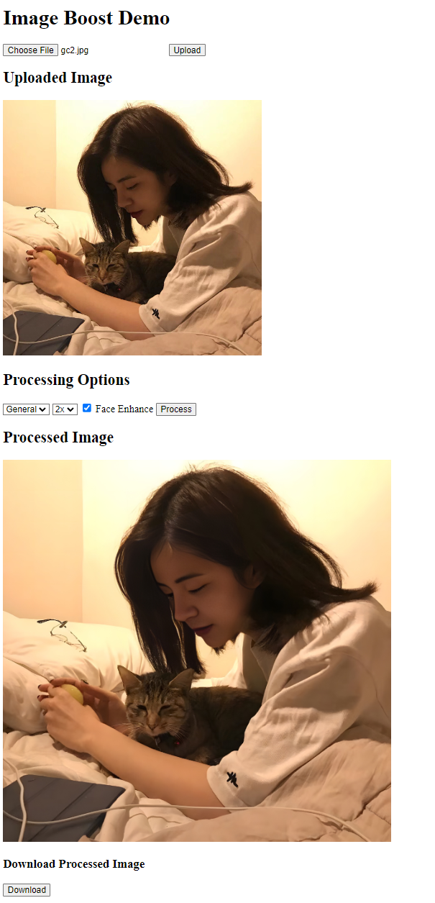

# Image Boost Web App
A Web application of [Image Boost Model](https://github.com/sumail25/ImageBoostModel) base on [Real-ESRGAN](https://github.com/xinntao/Real-ESRGAN)

---

## Web Demo

This is a web application for image super-resolution based on Real-ESRGAN using flask. 

Users can upload their own images, choose appropriate parameters, and obtain high-resolution images after super-resolution, which can be downloaded.

<p align="center">
    
</p>

---

## How to Use

1. **Environment**
   - Python >= 3.7
   - PyTorch >= 1.7
2. **Installation**
   *Please refer to section "How to Use" of [Image Boost Model](https://github.com/sumail25/ImageBoostModel).*
   ```bash
   # create environment
   conda create -n image_boost python=3.9

   # Install PyTorch
   # Here we choose CUDA 11.8 as compute platform
   pip3 install torch torchvision torchaudio --index-url https://download.pytorch.org/whl/cu118

   # Other requirements
   pip install -r requirements.txt
   ```

3. Run app.py
   ```console
   python backend\app.py
   ```
   Open [Image Processing Demo:](http://localhost:5000/) http://localhost:5000/ webpage with your browser.

4. - Choose your image and Upload. You can preview your original image on the webpage.
   - For geranl images (landspaces, portraits), choose "General". if there are human faces in your image you can check "Face Enhance".
   - For anime images (manga, fanart, anime screenshots), choose "Anime". No need check "Face Enhance".
   - Click "Process" to upscale your image. It will take a few seconds, depending on the performance of your GPU (You can change tile size `-t, --tile` in app.py for runtime or CUDA memory issues). You can check the status on your backend terminal
  
5. After processing, you can preview your processed image on this page and click the "Download" button to download it.

---

#### TODO

- Multiple image processing queue
- Interface typesetting
- History management